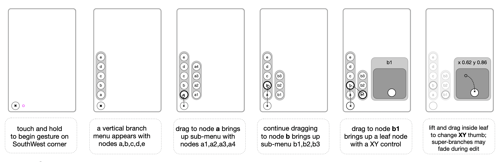
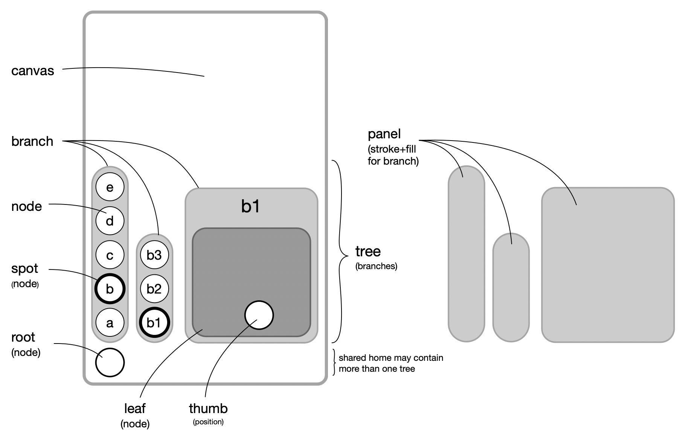

# Deep Menu 

### Interaction

### Components

#### Naming convention for components
DeepMenu follows a MVVM pattern (Model, View, View Model) 

+ MuNode* - proxy for Model, such as MuNodeTr3
+ Mu*View - SwiftUI View for [root,tree,branch,panel,node,leaf] 
+ Mu*Vm   - View Model for [root,tree,branch,panel,node,leaf] 

##### MuRoot* - starting point for one of more MuTree(s)
+ MuRootVm - touch, corner, pilot, trees, branchSpot, nodeSpot
+ MuRootView - manage UIViews for each corner 
+ MuRootStatus - publish changed state in [root,tree,edit,space]

##### MuTree* - horizonatal or vertical hierarcy of MuBranches 
+ MuTreeVm - select MuNode, add or remove sub-branches
+ MuTreeView - SwiftUI view collection of MuBranch's 

##### MuBranch* - one level in a hierachy containing MuNodes
+ MuBranchVm - view model of a branch
+ MuBranchView - SwiftUI view collection of MuNodeViews
+ MuBranchPanelView - background panel for MuBranchView
        
##### MuNode* - A persistent model of items (shared by many Mu*Vms) 
+ MuNode - a generic node, may be shared my many NodeVm's (and views)
+ MuNodeTr3 - a node proxy for Tr3 items 
+ MuNodeVm - a view model for a View, may share a Node from another Vm
+ MuNodeView - a SwiftUI view, has a companion MuNodeVm
+ MuNodeIconView - a subview of MuNodeView for icons
+ MuNodeTextView - a subview of MuNodeView for text
        
##### MuLeaf* - subclass of MuNode with a user touch control  
+ MuLeafTap - tap to activate, like a drum pad
+ MuLeafTog - toggle a switch 0 or 1
+ MuLeafSeg - segmented control
+ MuLeafVal - single dimension value
+ MuLeafVxy - 2 dimension xy control
   
##### MuPanel* - stroke+fill branches and bounds for node views
+ MuPanelVm - type, axis, size, and margins for View
+ MuPanelView - SwiftUI background 
+ MuPanelAxisView - vertical or horizontal PanelView 

##### MuTouch* - capture touches which are captured by aall branches
  - MuTouch - manage touch's [begin,moved,ended] state plus taps
  - MuTouchVm - state for root and drag nodes
  - MuTouchView - view for root and drag nodes
   
##### Prefixes and Suffixes
+ component instances 
  - *Vm - instance of view model, such as branchVm
  - *Vms - array of [*Vm], such as branchVms
+ point, size, radius, spacing 
  - x* - x in a CGPoint(x:y:)
  - y* - y in a CGPoint(x:y:)
  - w* - width  in CGSize(width:height)
  - h* - height in CGSize(width:height)
  - r* - radius / distance from center of a node
  - s* - spacing between nodes
+ hierarchy
  - spot* - spotlight on current Node or Branch
  - parent* - parent in model hierarchy
  - children* - [child] array in model hierarchy
  - child - current child in for loop
  - super - a parent in a view hierarchy
  - sub - a child in view hierarcy
             
### Relationships between classes and structs 
+ `treeVm ▹▹ branchVm ▹▹ nodeVm ▹ leafVm ◃◃ node`
  - treeVm   to branchVm {1,}   // 1:M array [branchVm]s expanded  
  - branchVm to nodeVm   {1,}   // 1:M a branchVm has 1 or more nodeVms
  - nodeVm   to leafVm   {0,1}  // 1:1 optional leaf
  - leafVm   to node     {1,1}  // 1:1 one branchVm for each nodeVm    
  - node     to leafVm   {0,}   // 1:M may be shared by many or cached

### logging symbols
  - `0.00 🟢` start touch at time 0.00  
  - `0.44 🔴` end touch at delta time 0.44
  - `0.33 🟣¹` single tap (² double, ³ triple, etc)
  - `touch∙(393, 675)` coordinate of touch event
  - `🧺` found cached instance
  - `√` `𐂷` `✎` `⬚` - status: .root .tree .edit .space
  - `V⃝ 1⇨0=0` vertical branch from single level to hidden 
  - `H⃝ 0⇨1=1` horzontal branch from hidden to single level

  
### SwiftUI restrictions
+ SwiftUI Views do not modify its own state  
  - So, no @State, @Binding, or @StateObject are used
  - Instead, change state in view model (Vm)
+ View Model(Vm) is a class, not struct
  - fine tuned @Published to update View
  - synchronize state between devices, including: iPhone, iPad, TV, watch, Shareplay
+ pros
    - @State has been somewhat buggy in the past
    - @State, @Binding, @StateObject adds semantic complexity
    - Simplify migration from UIKit with MVVM pattern
    - confusion on how to extract value from gestures
+ cons 
    - requires a manually enforced coding policy 
        
### SwiftLint violations - emphasis on columnwise alignment
    
+ Column-wise comments on right side
 
+ Finite State Machine columns for case statements

+ pros
  - Human Readable; catch mistakes
  - allow column-wise cursor to edit multiple rows at a time    

+ cons 
  - when refactoring, may need manual fixup
  - will not pass standard SwiftLint
  - requires a manually enforced coding policy 
  - cannot build documentation with right column /// comments 
  - maybe discarded in favor of dev team consensus 
        
##### Exceptions to columnwise alignment 
        
+ lvalue = rvalue, where equals(=) sign is always single space from lvalue

         name = value
         longerName = value
    
    so, avoid
      
         name       = value
         longerNmae = value
         
    to allow later searches 

         name =
         longerName =
             
##### Whitespace row after func (...)
 
+ separate spacer line after - easier to scan code for functions

        func foo (...) {
            
            let whatever = something
            ...
    
+ except for parameter cleanup - treated as part of entry point
    
        func foo(bar: Bar?) {
            guard bar = bar else { return }
            
            let whatever = something
            ...

see [Baeker & Marcus](https://dl.acm.org/doi/pdf/10.1145/800045.801621)
        using typography for source code
         

#### Use cases 

+ MuseSky - visual synth menu
+ Hand pose menu HUD for AR
+ Touch.AI - proof of concept

#### To Do

+ Root
  - Tap toggles hide/show last Views
  - Status line
  - voice over
  - taptic clicks
+ Tree
  - Transparent while editing leaf
  - Horizontal Test
+ Node
  - Callback to Tr3 example
  - Show icons 
+ Leaf 
  - Tr3 Callback & persist
  - Drag leaf to Sky
+ Touch 
  - finger latency to hop across Branches
+ Devices 
  - Synchonize Vms
  - iPad Mac layout
  - Apple Watch Layout
+ Touch.AI demos
  - Handpose overlay
  - Apple Watch Dial
  - Touch.AI web setup
+ Web
  - DeepMuse.com with DeepSky demo
  - Touch.AI site DeepMenu UI demo
  - link back from this readme to demos
+ Swift Package Manager

+ MuseSky integration
  - curate icon list
  - Sky as UIKit compatible view
  - replace Tr3Thumb.package
  - replace panel.*.tr3.h
  - refactor sky.tr3.h
  - refactor shader.tr3.h
  - refactor midi.tr3.h
  - control from Apple Watch
            
